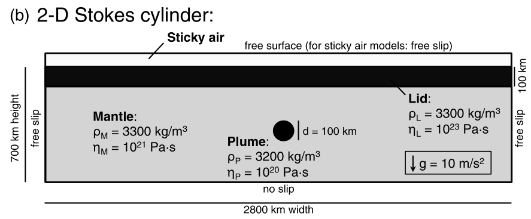
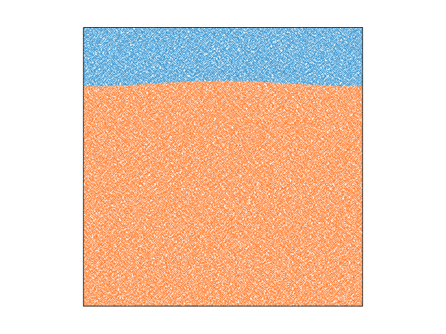

# topography_drunken_sailor
About
----
All of the approaches to free surface simulations (pseudo-free-surface formulation, 'stick air' approximation, ALE scheme) have been subject to an instability which has been termed a ‘‘sloshing,” or ‘‘drunken sailor effect” instability (Kaus et al., 2010).

This instability is arisen from the large density contrast typical at a free surface (surface or air-rock interface), compared with the much smaller internal density contrasts, severely limits the maximum stable timestep for free surface computations (Rose et al., 2017). 

Test Model
-----

Case 1： stick-air model

The model tested here is from case 2 in (Crameri  et al., 2012). 4 cases are tested and used the same time interval (fixed to 5k years), solver ("mumps" with penalty = 1e6).
(1) "stick air" with air density = 0 kg/m^3 
(2) with water density = 1000 kg/m^3
(3) air density and remove the reference density 
(4) water density and remove the reference density
(5) denser density = 3000 kg/m^3
(6) gradually changed density ( 3300 - 1 kg/m^3 within H = 50 km)

It turns out removing reference density can get the same results as not removing ones if doing the appropriate scaling. And comparing with air density, the water density model doesn't improve the stability a lot and will have a higher topography.

Case 2： Rayleigh-Taylor instability

The model tested here is from case 2 in (Kaus et al., 2010). 

Related issue
----
[Issue #363 in uw2](https://github.com/underworldcode/underworld2/issues/363)

[Issue #207 in uwg](https://github.com/underworldcode/UWGeodynamics/issues/207)

Solution (maybe)
----
- Free surface stabilization approach (FSSA) from (Kaus et al., 2010) [see this (?!?)] (https://bitbucket.org/bkaus/mvep2/src/master/SOURCE_CODE/Compute_FSSA_vec.m)

  Related underworld branch: [fssa-algo]
(https://github.com/underworldcode/underworld2/tree/jgiordani/fssa-algo)

Reference
-----
- Crameri, F., Schmeling, H., Golabek, G. J., Duretz, T., Orendt, R., Buiter, S. J. H., ... & Tackley, P. J. (2012). A comparison of numerical surface topography calculations in geodynamic modelling: an evaluation of the ‘sticky air’method. Geophysical Journal International, 189(1), 38-54.
- Kaus, B. J., Mühlhaus, H., & May, D. A. (2010). A stabilization algorithm for geodynamic numerical simulations with a free surface. Physics of the Earth and Planetary Interiors, 181(1-2), 12-20.
- Rose, I., Buffett, B., & Heister, T. (2017). Stability and accuracy of free surface time integration in viscous flows. Physics of the Earth and Planetary Interiors, 262, 90-100.
